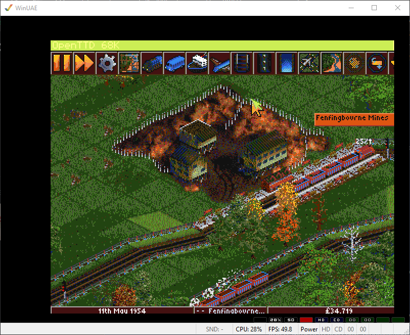
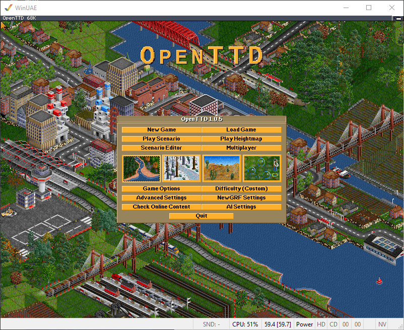

# OpenTTD for AmigaOS 68k (AGA / OCS-ECS / RTG)

A native port of OpenTTD 1.0.5 to classic AmigaOS 3.x on 68k, with its own video
driver written against Intuition and graphics.library. No SDL, and no RTG card
required — it runs on plain AGA, and on OCS/ECS too.

Playable. See the [releases](../../releases) for the ready-to-run archive.

## What works

Map generation, save/load, the menus and scenario editor, building rail, road,
stations and depots, running vehicles and giving them orders. Full mouse
(including right-drag scrolling), keyboard and arrow-key map scrolling.

**Computer opponents** — a native C++ AI written from scratch (neither the
in-engine nor the Squirrel AI would run on this port): cargo trains between
industries, passenger trains between towns, and local bus routes inside towns,
expanding as they get richer.

**Sound** through Paula, no software mixer: each effect goes straight to one of
the four hardware channels and DMA plays it, so the CPU does nothing once a sound
starts. **Music** is the game's own soundtrack, streamed from disk as ADPCM WAV
on two Paula channels. Enable with `-s amiga -m amiga` (`-s null` / `-m null` for
silence).

Resolution is selectable in Game Options and takes effect immediately: `320x256`,
`352x272` and `640x480` in AGA; `320x256` and `352x272` in **OCS**; then RTG
modes if a card is present. The interface font follows the resolution.

The **OCS/ECS** modes are Extra Half-Brite (6 bitplanes, 64 colours, the upper 32
forced to half-brightness copies of the lower 32). That means a quarter less
chunky-to-planar work, half the Chip RAM for the bitmap, and — because EHB exists
on OCS/ECS — a chance of running on an A500/A600. They are lores only: the sixth
bitplane *is* the half-brite control, and OCS/ECS cannot fetch six planes at
hires bandwidth. Switching between AGA, OCS and RTG needs a restart (the choice
is saved immediately and shown on screen).

**If it runs too slowly, use a lores mode** — it converts a quarter of the pixels
of `640x480` and is not interlaced. On an 030, lores is the only playable
configuration, and even then generate a small map.

## What does not

- **No networking** in this build.
- Memory use is high: ~24 MB total required. The OCS modes cut colours, not
  sprite size, so they do not yet lower it — half-size graphics are the next step.

## Requirements

- **68020 minimum, no FPU needed.** 68040/40 recommended, 68060/50 for full
  speed; tested on a bare 020, an 030 with no coprocessor, and an 040. Slow at
  stock 030 speeds. (The FPU requirement was removed in 0.7.0 — the cause was
  `printf` pulling FPU code into libnix's prologue, not the maths; building with
  `-mcpu=68020 -msoft-float` fixes it. Only map generation uses floating point.)
- **AGA, or OCS/ECS, or a Picasso96 / CyberGraphX RTG card.** RTG is worth having
  if you own one: the chunky 8bpp buffer goes to an 8bpp RTG screen essentially
  unchanged, skipping chunky-to-planar entirely.

  
- **24 MB Fast RAM** (won't start on 4 MB Fast + 16 MB Z3; does on 8 + 16).
  AmigaOS 3.0/3.1, ~30 MB free disk.

Nothing from the original Transport Tycoon Deluxe is needed — the archive bundles
OpenGFX and OpenSFX and runs as unpacked.

## Why 1.0.5

The last comfortable base for this target: C++03 (buildable with bebbo's
m68k-amigaos GCC 6.5, where later OpenTTD needs C++11/17/20), an 8bpp blitter by
default (a chunky palette buffer, exactly what a chunky-to-planar converter
wants), all external libraries optional, and the first release that is legally
redistributable via OpenGFX/OpenSFX. 1.0.5 still carries OpenTTD's own
Amiga/MorphOS scaffolding (removed upstream in 2019); what never existed upstream,
and what this repo adds, is a real Amiga video/sound driver and the native AI.

## How the display works

OpenTTD draws into a chunky 8bpp buffer in Fast RAM (`_screen.dst_ptr`); getting
that onto an AGA screen is the only Amiga-specific step. The screen owns one
contiguous Chip RAM block for all bitplanes (`SA_BitMap`), conversion uses Mikael
Kalms' 68040 `c2p_rect`, and only changed rectangles are converted (from
OpenTTD's own dirty-block list). On an A4000/040/25 a 320x256 frame is ~30 ms
through c2p — but a full-screen repaint almost never happens in play.

## Building

See [BUILDING.md](BUILDING.md) and read it first. The toolchain has traps that
produce silently wrong code rather than errors: several files miscompile at `-O1`
and must be built at `-O0`, `-O2` breaks C++ exception unwinding, and zlib
corrupts data above `-O0`.

## Credits

- Written by angree, with Claude (Anthropic) used heavily throughout — driver and
  AI code, build work, and the isolation testing that tracked down the toolchain
  miscompilations.
- OpenTTD, GPL v2 — <https://www.openttd.org/>
- Chunky-to-planar by Mikael Kalms, public domain —
  <https://github.com/Kalmalyzer/kalms-c2p>
- OpenGFX / OpenSFX by the OpenTTD community
- bebbo's amiga-gcc — <https://github.com/bebbo/amiga-gcc>

## Licence

GPL v2, following OpenTTD. Kalms' c2p is public domain and keeps its own terms.
