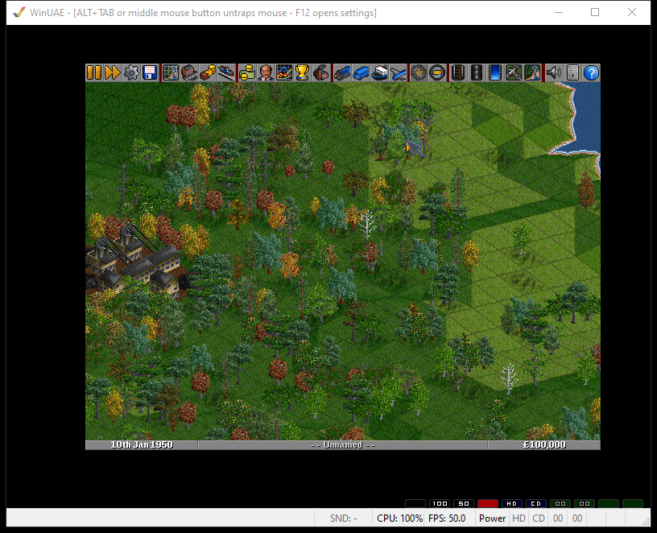

# OpenTTD for AmigaOS 68k (AGA/P96)

A native port of OpenTTD 1.0.5 to classic AmigaOS 3.x on 68k, with its own video
driver written against Intuition and graphics.library. No SDL, and no RTG card
required — it runs on plain AGA.

Early, but playable.

## What works

Map generation, saving and loading, the menus and the scenario editor, building
rail, road, stations and depots, running vehicles and giving them orders. Full
mouse control including right-drag scrolling, the keyboard, and arrow-key map
scrolling.

Resolution is selectable in Game Options and takes effect immediately:
`320x256 AGA`, `352x272 AGA` (PAL lores, no interlace) and `640x480 AGA`
(hires, interlaced); then `320x256 OCS` and `352x272 OCS`; then the RTG modes
if a graphics card is present. The interface font follows the resolution.

The **OCS** modes are Extra Half-Brite: 6 bitplanes, 64 colours, where the upper
32 are forced by the hardware to be half-brightness copies of the lower 32. That
buys three things at once — a quarter less chunky-to-planar work, half the Chip
RAM for the bitmap, and, because EHB exists on OCS and ECS as well as AGA, the
possibility of running on an A500 or A600. Sprites are reduced to the 64-colour
palette once when they are loaded, not per frame.

They are lores only, and that is a hardware fact rather than an omission: the
sixth bitplane *is* the half-brite control, and OCS/ECS cannot fetch six planes
at hires bandwidth. A "640x480 OCS" entry would simply be refused.

Changing between AGA, OCS and RTG needs a restart — the choice is saved
immediately and the game says so on screen.
They are labelled AGA because a Picasso96/RTG backend is planned and will add
its own modes to the same list.

**If the game runs too slowly, switch to one of the lores modes.** They convert
a quarter of the pixels of `640x480`, which is the single biggest lever you
have, and they are not interlaced, so the display is steadier as well. On an 030
lores is the only configuration with a chance of being playable at all — and
even then, generate a small map.

## Sound

Sound effects work, played straight through Paula. There is no software mixer:
each effect is handed to one of the four hardware audio channels and DMA plays
it, so once a sound starts the CPU does nothing at all. Volume and panning are
the hardware's own registers rather than arithmetic on samples.

The conversion turns out to be almost free. OpenSFX ships at 44.1 kHz 16-bit,
and Paula wants 8-bit and tops out around 28.6 kHz on PAL — so the target rate
is 22.05 kHz, which is exactly half. Resampling is therefore "take every other
sample" and the depth change is a shift, done once per effect and then cached in
Chip RAM. No interpolation, no lookup tables, no per-sample CPU cost.

The cost of this approach is that there are only four channels, so a fifth
simultaneous sound is dropped rather than mixed. In practice that is rarely
noticeable, and it buys a sound system that is essentially free on a 68030.

Enable it with `-s amiga` (and `-s null` for silence). **Music is not
implemented yet.**

## What does not

- **No networking** in this build.
- AGA/RTG, and no ECS/OCS
- Memory use is high: 24MB total memory required. Half-size graphics and a
  smaller cache are the planned.

## Requirements

- **68030 with an FPU, minimum. 68040/40 recommended, 68060/50 for full speed.**
  Tested working on an 030+FPU and on an 040; at stock 030 clock speeds it is
  slow. The chunky-to-planar converter is the 68040 one, which is part of why —
  a blitter-assisted variant for 020/030 is the obvious next step.
- **An FPU is required.** No 68LC040, no 68EC030, and a bare 020 will not do.
  This is worth explaining, because the binary is built `-msoft-float` and that
  sounds like it should not need one: in this toolchain the double-precision
  routines are thin stubs into `mathieeedoubbas.library`, and the stubs
  themselves execute FPU instructions. So the float ABI is soft, but the
  runtime is not. Only map generation uses floating point at all — the
  simulation is integer-only by design, because OpenTTD keeps multiplayer
  deterministic across platforms — which is exactly where an FPU-less machine
  fails.
- **AGA**, or a Picasso96 / CyberGraphX RTG card. A1200, A4000 or CD32 for the
  AGA path.

  RTG is worth having if you own a card: OpenTTD renders into a chunky 8bpp
  buffer, so on an 8bpp RTG screen that buffer goes to the display essentially
  unchanged and the chunky-to-planar conversion - the most expensive thing the
  driver does on AGA - disappears entirely. RTG modes are offered from 400x300
  upward and appear below the AGA ones in Game Options.
- **24 MB Fast RAM.** Tested: it will not start on 4 MB Fast + 16 MB Z3, but
  does on 8 + 16, leaving about 10 MB free. The executable alone occupies
  4.6 MB once loaded, and the sprite cache another 4 MB.

- AmigaOS 3.0 or 3.1, ~30 MB free disk space.

Nothing from the original Transport Tycoon Deluxe is needed. The release archive
bundles OpenGFX and OpenSFX, so it runs as unpacked.

## Why 1.0.5

It is the last comfortable base for this target. It is C++03, so the bebbo
m68k-amigaos GCC 6.5 toolchain can build it, where later OpenTTD needs
C++11/17/20. It defaults to the 8bpp blitter, so the game already renders into a
chunky palette-index buffer — exactly the input a chunky-to-planar converter
wants. All external libraries are optional. And it is the first version that is
legally redistributable, because OpenGFX and OpenSFX exist from 1.0.0 onwards;
Transport Tycoon Deluxe never shipped on Amiga, so users cannot be expected to
supply the original data files.

1.0.5 also still contains OpenTTD's own Amiga/MorphOS scaffolding, removed
upstream only in 2019. What never existed upstream, and what this repository
adds, is a real Amiga video driver.

## How the display works

OpenTTD draws into a chunky 8bpp buffer in Fast RAM, handed to it as
`_screen.dst_ptr`, so the blitter needs no adaptation. Getting that onto an AGA
screen is the only Amiga-specific step:

- The screen owns **one contiguous Chip RAM block** for all eight bitplanes,
  built by hand and passed to Intuition with `SA_BitMap`. `AllocBitMap()` does
  not guarantee equally spaced planes, and the c2p requires them.
- Conversion uses **Mikael Kalms' 68040 `c2p_rect`**, written for exactly this
  case: dirty-rectangle updates in a windowing system.
- Only changed rectangles are converted, kept as a list rather than one bounding
  box — OpenTTD's `DrawDirtyBlocks()` already reports each region separately. On
  the title screen that measures at 60-70% fewer pixels converted.

Measured on a WinUAE machine calibrated against SysInfo to a real A4000/040/25:
a 640x512 full frame takes 388 ms through `WritePixelArray8` and 117 ms through
`c2p_rect`; 320x256 takes 96 ms versus 29.6 ms. A full-screen repaint is
therefore around 8.5 fps on an 040/25 — but a full repaint almost never happens
in normal play.

## Building

See [BUILDING.md](BUILDING.md), and read it before you start. The toolchain has
several traps that produce silently wrong code rather than errors: five source
files miscompile at `-O1` and must be built at `-O0`, `-O2` breaks C++ exception
unwinding outright, and zlib returns corrupt data above `-O0`. Each one cost a
day to find.

## Credits

- Written by angree, with Claude (Anthropic) used heavily throughout — for the
  driver code, the build work, and in particular the isolation testing that
  tracked down the toolchain miscompilations.
- OpenTTD, GPL v2 — <https://www.openttd.org/>
- Chunky-to-planar routines by Mikael Kalms, public domain —
  <https://github.com/Kalmalyzer/kalms-c2p>
- OpenGFX and OpenSFX by the OpenTTD community
- bebbo's amiga-gcc toolchain — <https://github.com/bebbo/amiga-gcc>

## Licence

GPL v2, following OpenTTD. Kalms' c2p is public domain and keeps its own terms.
